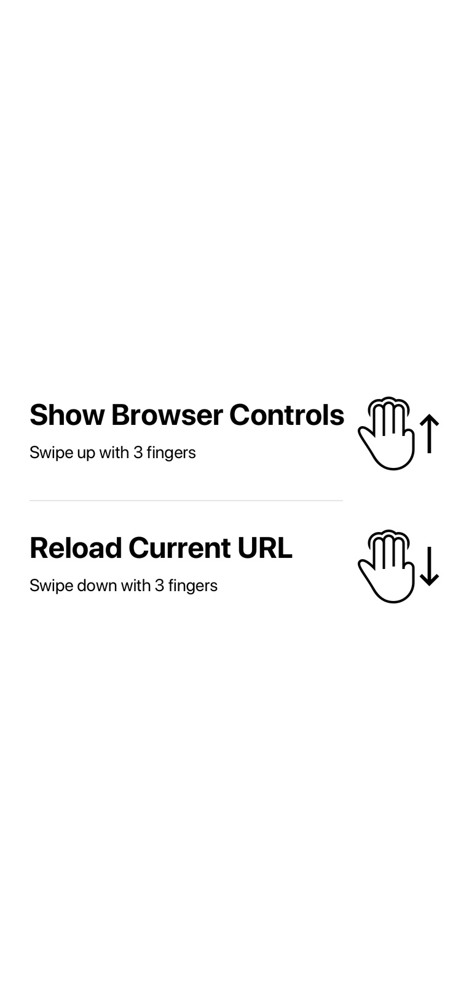
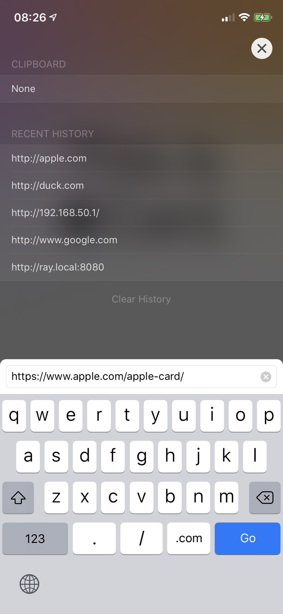

# Foo Screen
A full screen browser made for interactive prototypes. Typically a framer.js/p5.js/processing.js/lottie.js/SVG/Canvas/WebGL or any webkit technology based project. Not for general internet surfing use.

- No overlaid buttons/bars
- No Status bar/Home indicator
- Gesture interactions

This App is available on App Store for $0.99/￥1 : https://itunes.apple.com/us/app/id1465367307&mt=8

You can also clone this project and build the App to your iOS devices with Xcode directly.

| Screenshot 1 | Screenshot 2 |
| --- | --- |
|  |  |

# Contribute
[Submit an Issue](https://github.com/RayPS/Foo-Screen/issues) to contribute ideas or request features

# License
Licensed under [ROL](http://git.io/read-only-license)
